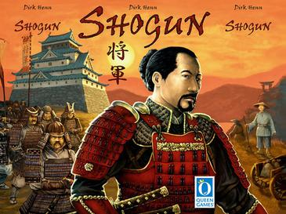
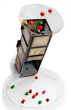
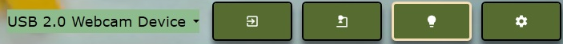
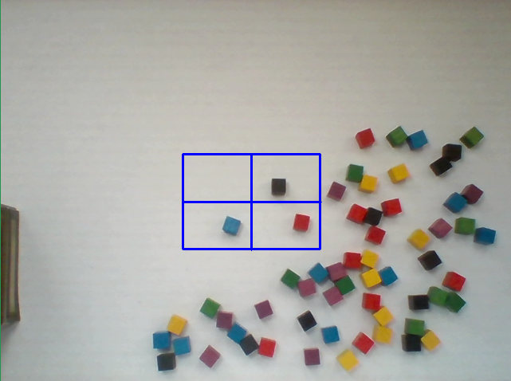
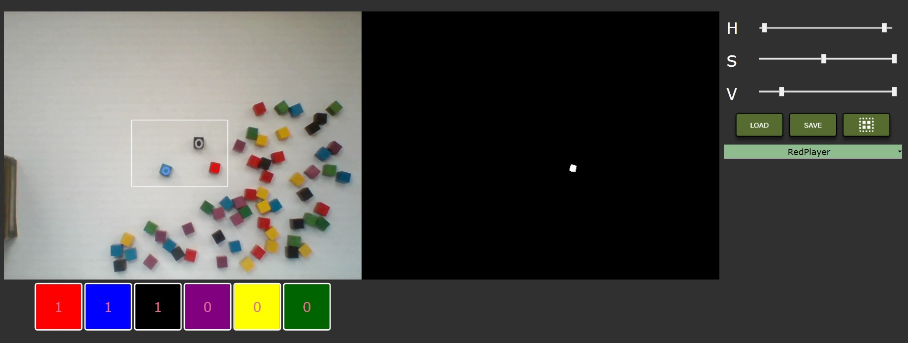
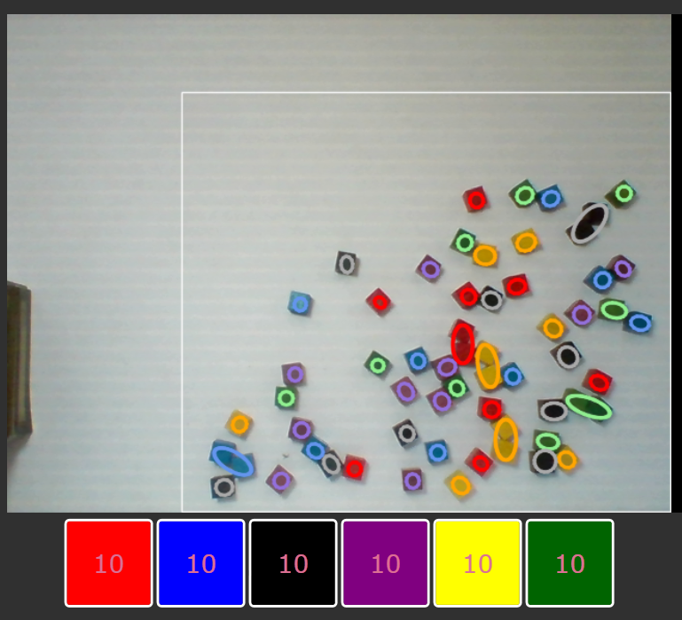
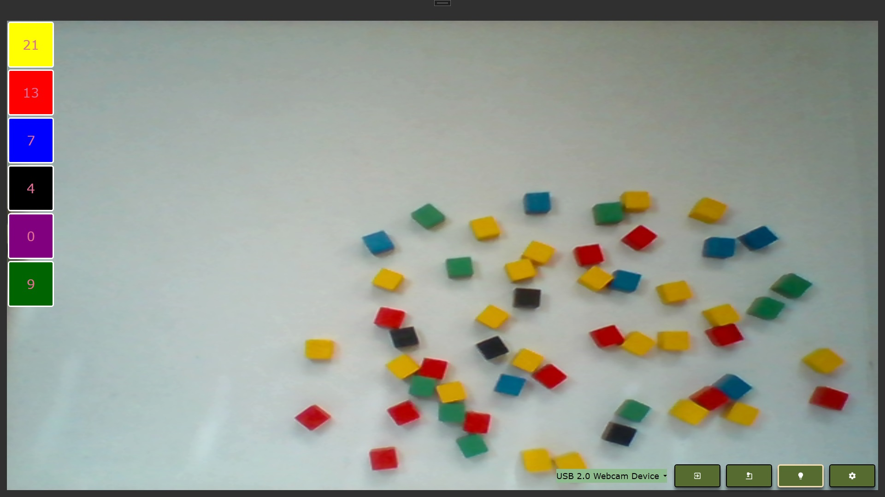

# ShogunVS
The project contains an application that improves the gameplay of a "Shogun" board game. It uses a USB camera video stream supported by light control to analyze battle results by counting the number of cubes dropped from the Cube Tower.

  
&nbsp; &nbsp; &nbsp; &nbsp;&nbsp;&nbsp;
  

## Introduction
The game is destined for a maximum of 5 players, each one controls armies represented by cubes of unique color, while green cubes are neutral. If battle ensues between opposing armies, the troops from both sides are thrown in together and the cubes that fall out at the bottom show who has won immediately.

The application is designed for players who want to speed up the game battle process by quickly pointing out the winner through an app. The environment for the vision system was prepared to reduce the light reflections, a plastic stand was replaced with cardboard and an RGB light bulb was used to provide better light conditions. 

## Packages used:
- [Prism](https://prismlibrary.com/index.html) - MVVM design, commands, event aggregation
- [OpenCvSharp4](https://www.nuget.org/packages/OpenCvSharp4) - OpenCv wrapper for image processing + WPF extensions
- [MaterialDesign](http://materialdesigninxaml.net/) - temples, styles, themes for WPF controls
- [Json.NET](https://www.newtonsoft.com/json) - serializing settings
- [YeelightAPI](https://github.com/roddone/YeelightAPI)- C# API (.Net) to control Xiaomi Yeelight Color Bulbs
- [MahApps.Metro](https://github.com/MahApps/MahApps.Metro) - WPF UI toolkit
- [Extended WPF Toolkit](https://github.com/xceedsoftware/wpftoolkit) - WPF controls and components
- [DirectShowLib](https://github.com/larrybeall/DirectShowLib) - access to Microsoft's DirectShow functionality
- [ControlzEx](https://github.com/ControlzEx/ControlzEx) - WPF controls

## Setup
- the project is based on .NET 4.8.
- USB camera visible for DirectShow
- (optional) Yeelight W3 E27 light bulb or similar located near tower - [Setup](https://us.yeelight.com/blogs/install-smart-bulb-to-wifi/)

### Launch
- choose the right image stream source, from the list at the bottom of the main screen:

  

- select the region of interest on the settings screen
- adjust threshold values (if necessary)

  

  

## Usage
The setup result can be checked on the preview with output values:

  

The main screen presents a better view of the battlefield and puts the results in order, starting from the player with the most cubes at the top (while green cubes remain neutral):

  

## Things to do:
- real-time adjustment of color thresholds by selecting screen area
- fix bug with contour detection in low light
- auto-adjust thresholds for selected colors
- message info about the winner and results
- adding neutral cubes number to selected player result
